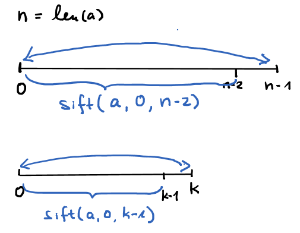

Wenn die erste Zeile mit 4 Hash beginnt, wird in Github
das encoding nicht erkannt und die Umlaute erscheinen falsch. Dann in der ersten Zeile zwei Leerzeichen eintippen.

__[Github Flavoured Markdown Doku](https://github.github.com/gfm/#block-quotes)__

__[Common Markdown Spec](https://spec.commonmark.org/0.29/#tabs)__
 

## Große Überschrift mit 2 Hash

#### Kleinere Überschrift mit 4 Hash

Normaler Text.  
Zeilenvorschub durch 2 Leerzeichen nach Satzende.

`Text inline Code` mit  `Strg M, Strg I`

*kursiv* und **fett** mit `*kursiv*` und `**fett**`

```
Text als Code Block
mit Strg M, Strg C

``` 

#### Link

Link [doc](https://github.com/adam-p/markdown-here/wiki/Markdown-Cheatsheet)
  mit `[doc](https://github.com/adam-p/markdown-here/wiki/Markdown-Cheatsheet)`

#### Bilder

``  für




#### Collapsible  

Dies funktioniert in Github Pages nur mit
`markdown: CommonMarkGhPages ` in der `_config.yml
`
<details><summary>Show</summary>
<p>

```python
print("hello world!")
```
</p>
</details>

#### Markdown in VS-Code

`Strg K, V` = preview  
`Strg M, Strg I` = toggle inline code    
`Strg M, Strg C` = toogle code-block 

---- 